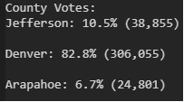
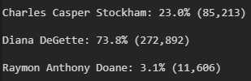
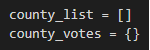
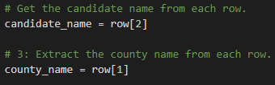

# Election-Analysis
# Analysis of Election Outcome
>Python script reads, calculates, and outputs results from election across 3 counties

## Overview of Election Audit
>Data collected and stored in a CSV file after an election is analyzed and organized to provide an easy to read TXT file displaying the winner of the election, number of votes per candidate, percentage of votes each candidtate received, voter turnout by county, percentage of votes per county, and the county with the highest voter turnout.

### Election Audit Results
    - There were 369,711 votes cast in this congressional election.
    - The breakdown of number of votes and percentage of total votes per county is as follows: 
    
    - Denver county achieved the highest vote count at 306,055 total votes. 
    - The breakdown of number of votes and percentage of total votes per candidate is as follows: 
    
    - The winner of the election was candidate Diana DeGette with 73.8% of the total votes, a vote count amounting to 272,892.

## Election Audit Summary
> The script is easily modified to be used for any election, regardless the number of candidates or precinct type. 
> Modifications allowing for reuse of the script are as follows:
    - Subbing in the file path for the CSV of data for the designated election and the TXT file to be used to display the results.
    
    - Replacing all instances of 'county' with appropriate electoral unit if the electoral districts are not counties.
    
    - Updating the row index for the new CSV file if need be to refer to the correct data. 
    